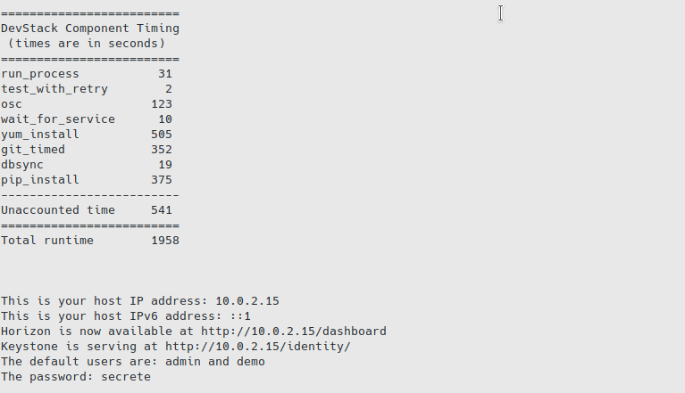
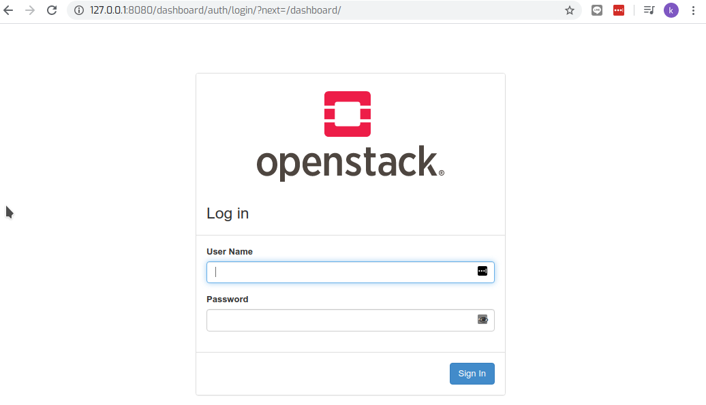

## Single node  Devstack

install devstack  on single interface

```
cd lab2
vagrant up

vagrant ssh
sudo su - stack

./stack.sh
```

### Result success build




### Flush iptables

```
sudo iptables -F
```

## open Browser http://127.0.0.1:8080/dashboard




## Use vagrant to manage snapshot

- Exit to host machine

```
vagrant snapshot save  lab2

==> devstack2: Snapshotting the machine as 'lab2'...
==> devstack2: Snapshot saved! You can restore the snapshot at any time by
==> devstack2: using `vagrant snapshot restore`. You can delete it using
==> devstack2: `vagrant snapshot delete`.
```

```
vagrant snapshot list     
==> devstack2: 
lab2
```


```
vagrant snapshot restore lab2
```

### Referece Using save:

- List Snapshots

```
vagrant snapshot list
```

- Create a Snapshot

```
vagrant snapshot save SNAPSHOTNAME
```

```
vagrant snapshot save snapshot01
```

- Restore a Snapshot

```
vagrant snapshot restore SNAPSHOTNAME
```

```
vagrant snapshot restore snapshot01
```

- Delete a Snapshot

```
vagrant snapshot delete SNAPSHOTNAME
```

