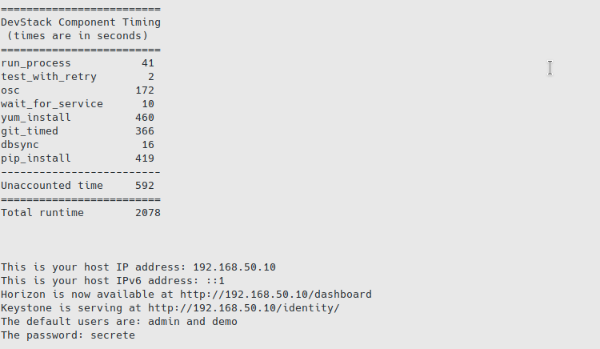
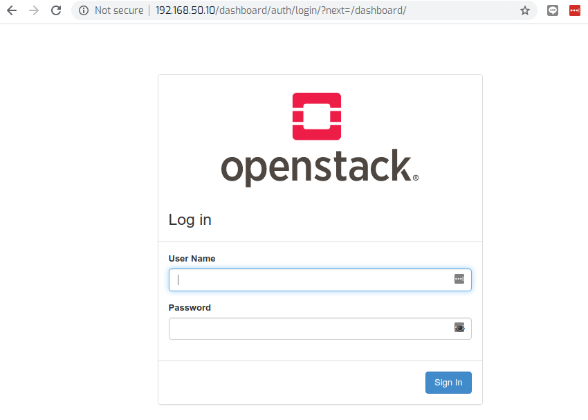
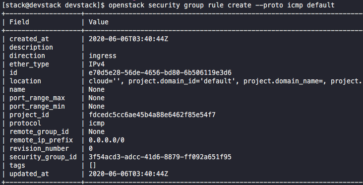
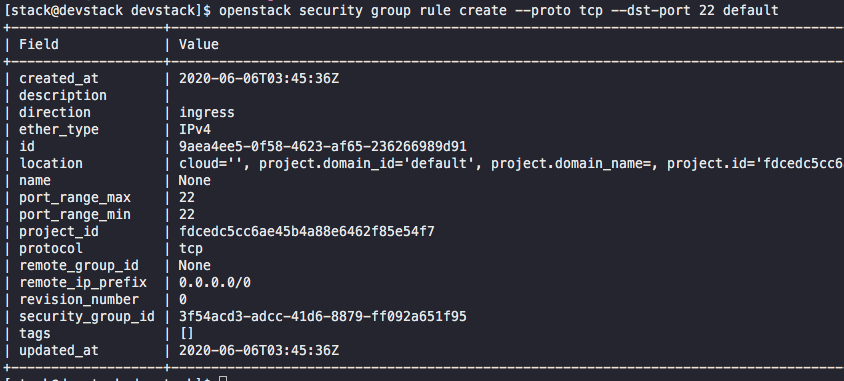
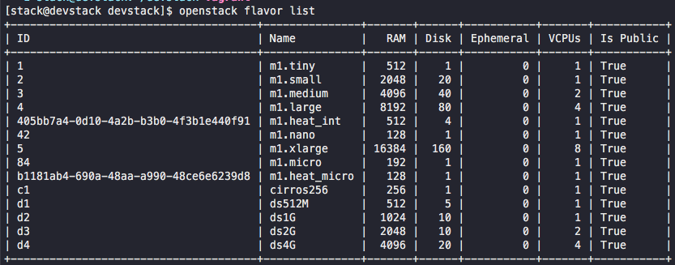
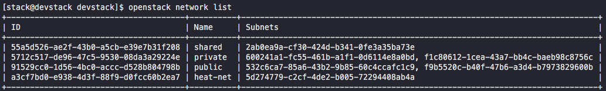
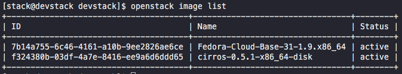
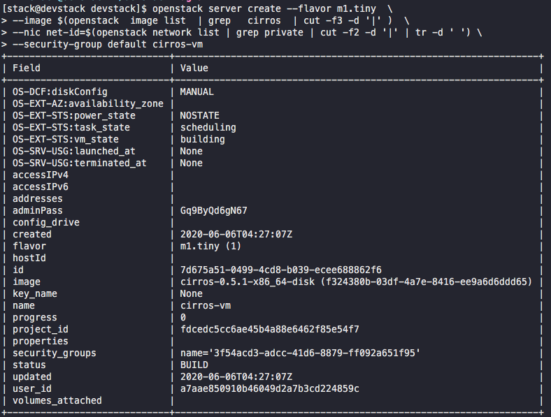
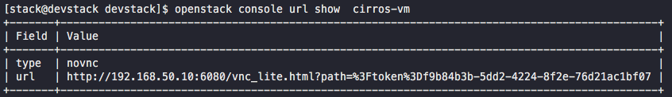

## Build project

```
cd lab3
vagrant up
vagrant ssh -c "ip a"
vagrant ssh
```

## Switch user to stack

```
sudo su - stack
cd devstack
./stack.sh
```

### Result success build




## Flush iptables

```
sudo iptable -F
```

## open Browser http://192.168.50.10/dashboard



## Use vagrant to manage snapshot

- Exit to host machine

```
vagrant snapshot save  lab3
```


```
vagrant snapshot restore lab3 
```

### Referece Using save:

- List Snapshots

```
vagrant snapshot list
```

- Create a Snapshot

```
vagrant snapshot save SNAPSHOTNAME
```

```
vagrant snapshot save snapshot01
```

- Restore a Snapshot

```
vagrant snapshot restore SNAPSHOTNAME
```

```
vagrant snapshot restore snapshot01
```

- Delete a Snapshot

```
vagrant snapshot delete SNAPSHOTNAME
```

## Command Workshop Devstack

In this lab3 will create openstack with neutron on second interface eth1 and also share eth1 subnet for
new vm in openstack

- Check logical volume group that devstack create for cinder backend with command ```vgs``` ```lvs```

```
sudo vgs

sudo lvs
```

by default, Linux use create loop devices to support those volues

```
sudo losetup -l
```

> loop back device will recreate on system boot. recomment to create snapshot the vm during running vm.
in order to save staging of vm and restore later

#### Connect to openstack with Cli 

There are 2 methods to connect to running openstack. First is Web interace and second is commandline. follow lab's objective to show how to use cli to connect to openstack and manage to create vm inside openstack


- Login with rc file  (openrc in devstack folder) run command ```source``` against openrc file. The result is environment variable will be set.

```
cd devstack
source openrc

WARNING: setting legacy OS_TENANT_NAME to support cli tools.
```

- Create security group name "default" as firewall of system with Openstack command  ```openstack security group rule create```   for icmp and 

[link to command!] (https://docs.openstack.org/python-openstackclient/latest/cli/command-objects/security-group-rule.html)

```
openstack security group rule create --proto icmp default
```




```
openstack security group rule create --proto tcp --dst-port 22 default
```



- Check flavor (size of vm) 

```
openstack flavor list
```




- Check network in openstack

```
openstack network list
```
> we alway use id  rather than name to create vm



```
openstack network show 91529cc0-1d56-4bc0-accc-d528b804798b
```

- Check image list

```
openstack imaage list
```



- Now Create VM instance with command ```openstack server create```

    - use m1.small flavor
    - use image fedora
    - use private network

```
openstack server create --flavor m1.tiny  \
--image $(openstack  image list  | grep   cirros  | cut -f3 -d '|' )  \
--nic net-id=$(openstack network list | grep private | cut -f2 -d '|' | tr -d ' ') \
--security-group default cirros-vm
```



wait vm create and run follow command to check


```
openstack server list
```


- get openstack vnc show url

```
openstack console url show  cirros-vm
```



open browser and go to url


login with user   'cirros'  with password  'gocubsgo'